# Table of Contents

1. [Define Scope & Objectives](#section-1-define-scope--objectives)
2. [Data Preparation](#section-2-data-preparation)
3. [Ontology Design & Modeling](#section-3-ontology-design--modeling)
4. [Knowledge Graph Implementation](#section-4-knowledge-graph-implementation)
5. [Hybrid RAG Development](#section-5-hybrid-rag-development)
6. [Testing & Iteration](#section-6-testing--iteration)
7. [Deployment & Continuous Improvement](#section-7-deployment--continuous-improvement)
8. [Appendix](#appendix)

---

# Section 1: Define Scope & Objectives

## **Purpose**
To create a scalable, iterative Knowledge Graph (KG) for Census data, enabling a hybrid Retrieval-Augmented Generation (RAG) system to integrate Neo4j, LangChain, and LLMs for advanced data querying and analytics.

## **Goals**
1. Provide a unified structure for all Census metadata and data relationships.
2. Enable efficient querying via a graph database (Neo4j) and natural language interactions.
3. Use LLMs to enrich metadata, identify relationships, and offer interpretive context.
4. Maintain an agile, evolving approach to accommodate new data and use cases.

## **Scope**
- **Included**:
  - American Community Survey (ACS): 1-Year, 5-Year.
  - Decennial Census metadata and variables.
  - Public metadata from `api.census.gov`.
  - Tracking variable evolution over time (e.g., changes in definitions or availability).
  - Integration of metadata annotations enriched by LLMs.

- **Excluded**:
  - External datasets beyond Census sources (e.g., third-party economic or policy data).
  - Proprietary or private datasets.

## **Key Decisions**
- Use **Neo4j** for graph database implementation.
- Build KG iteratively with a focus on known metadata first, expanding over time.
- Leverage **LangChain** to integrate KG with vector databases for hybrid RAG.
- Avoid excessive pre-planning to maintain agility and adaptability.

## **Success Criteria**
1. A functional Knowledge Graph that captures Census data and metadata relationships.
2. Ability to query and retrieve enriched, accurate responses through the hybrid RAG system.
3. A process for iterating and expanding the graph efficiently over time.

---
# Section 2: Data Preparation

## **Purpose**
To standardize, validate, and enrich Census metadata for ingestion into the Knowledge Graph, ensuring that initial data loads are accurate and aligned with project goals.

## **Goals**
1. Prepare metadata for key datasets (ACS 1-Year, ACS 5-Year, Decennial Census).
2. Validate existing metadata against official Census sources for completeness.
3. Create a prototype dataset to test initial KG implementation.
4. Use LLMs to enrich metadata with contextual annotations and variable evolution history.

## **Steps**
1. **Metadata Validation**:
   - Verify completeness of variable descriptions, survey types, and group associations.
   - Check metadata integrity using official Census documentation.

2. **Standardization**:
   - Normalize variable names and formats across datasets.
   - Ensure consistent geographic identifiers (e.g., FIPS codes).

3. **Prototype Dataset**:
   - Select a representative sample of variables from ACS and Decennial Census metadata.
   - Load into a Neo4j testing instance for validation and relationship modeling.

4. **Enrichment with LLMs**:
   - Generate detailed descriptions and insights for key variables.
   - Annotate reasons for variable changes over time.

## **Success Criteria**
1. Validated metadata ready for KG ingestion.
2. A functional prototype dataset demonstrating key relationships and usability.
3. Metadata enriched with LLM-generated insights for user-friendly querying.

---

# Section 3: Ontology Design & Modeling

## **Purpose**
To design a flexible and extensible ontology that defines the structure of the Knowledge Graph, including entities, relationships, and metadata, ensuring alignment with Census data standards.

## **Goals**
1. Create a schema to represent datasets, variables, geographic hierarchies, and metadata.
2. Define relationships between entities, including temporal and geographic associations.
3. Ensure compatibility with Neo4j for seamless implementation.

## **Key Entities**
1. **Datasets**:
   - ACS 1-Year, ACS 5-Year, Decennial Census.
   - Attributes: Year, Type, Coverage, Variables, Source.
   
2. **Variables**:
   - Attributes: Name, Description, Group, Availability (by year), Source, Evolution Notes.
   
3. **Geographic Levels**:
   - Nation, State, County, Tract, Block Group.
   - Relationships: Hierarchical (e.g., State > County > Tract).

4. **Metadata**:
   - Attributes: Collection Methodology, Margin of Error, Source Documentation.

## **Relationships**
1. **Temporal**:
   - Link variables across years to track changes and evolution.
   
2. **Geographic**:
   - Define relationships between geographic levels (e.g., State contains Counties).

3. **Conceptual**:
   - Link related variables (e.g., Median Household Income ↔ Poverty Rate).

## **Steps**
1. **Draft Ontology Schema**:
   - Use Protégé or similar tools to draft the schema with OWL or UML standards.
   
2. **Validate Ontology**:
   - Review with stakeholders to ensure alignment with Census standards.
   - Test for extensibility to future datasets or external integrations.

3. **Prepare for Implementation**:
   - Translate schema into a Neo4j-compatible format.
   - Develop scripts for automated KG construction.

## **Success Criteria**
1. An ontology that accurately models Census data relationships.
2. Validation of the ontology’s ability to represent key entities and relationships.
3. Compatibility with Neo4j for seamless implementation.

---

# Section 4: Knowledge Graph Implementation

## **Purpose**
To build and populate the Knowledge Graph (KG) in Neo4j, leveraging the ontology schema and prepared metadata to enable efficient data querying and analysis.

## **Goals**
1. Load entities, relationships, and metadata into Neo4j.
2. Test the Knowledge Graph for data accuracy, relationship integrity, and query performance.
3. Establish a foundation for iterative expansion and refinement.

## **Steps**
1. **Graph Initialization**:
   - Set up Neo4j instance with the defined schema.
   - Configure Neo4j for optimal performance (e.g., memory allocation, indexing).

2. **Data Ingestion**:
   - Use Python (`py2neo`) or Cypher scripts to load entities and relationships from metadata.
   - Ingest temporal and geographic relationships based on ontology.

3. **Validation**:
   - Run test queries to validate entity connections and data accuracy.
   - Ensure all geographic hierarchies (e.g., State > County > Tract) are correctly represented.

4. **Optimization**:
   - Index key entities and relationships to improve query performance.
   - Optimize memory usage and storage for large datasets.

5. **Prototype Query Testing**:
   - Create sample queries to demonstrate key functionalities (e.g., “Retrieve all variables available in California for 2020”).
   - Iterate on graph structure based on testing outcomes.

## **Success Criteria**
1. Fully populated Neo4j graph with validated entities, relationships, and metadata.
2. Successful execution of test queries with accurate results.
3. Optimized performance for scalability and usability.

---

# Section 5: Hybrid RAG Development (Refined)

## **Purpose**
To integrate the Knowledge Graph (KG) with an existing LLM platform (e.g., ChatGPT) and vector database, enabling natural language queries and advanced hybrid retrieval capabilities.

## **Goals**
1. Use the LLM as the primary interface for querying structured (KG) and unstructured (vector database) data.
2. Leverage platforms like LangChain to orchestrate the RAG pipeline.
3. Minimize custom API development, focusing on system integration instead.

## **Steps**
1. **LLM Integration**:
   - Configure ChatGPT (or equivalent) as the query interface.
   - Enable direct interaction with the KG (via LangChain-Neo4j).
   - Use vector database embeddings for unstructured text retrieval.

2. **Query Pipeline Development**:
   - Develop workflows in LangChain to orchestrate interactions:
     - KG queries via Neo4j.
     - Vector database searches for metadata/documents.

3. **Prototype Testing**:
   - Run real-world queries (e.g., “What was the poverty rate in Texas in 2019?”).
   - Validate the system's ability to combine KG and vector data in responses.

4. **Iterative Refinement**:
   - Use ChatGPT to simulate end-user interactions.
   - Iterate on workflows based on feedback.

## **Success Criteria**
1. A fully functional RAG system capable of answering natural language queries.
2. Seamless integration of ChatGPT with the KG and vector database.
3. Ability to refine and evolve the KG using insights from LLM-based testing.

---

# Section 6: Testing & Iteration

## **Purpose**
To validate the functionality, accuracy, and performance of the Knowledge Graph (KG) and hybrid RAG system while incorporating user feedback to iteratively improve the system.

## **Goals**
1. Ensure the KG and RAG system provide accurate, meaningful responses to user queries.
2. Identify and resolve gaps in metadata, relationships, or system integration.
3. Optimize system performance for scalability and usability.
4. Collect and integrate user feedback for continuous improvement.

## **Steps**
1. **Test Coverage**:
   - Develop a comprehensive set of test queries:
     - **Structured Queries**: Directly query the KG using Cypher (e.g., retrieving variables by geography and year).
     - **Hybrid RAG Queries**: Combine structured KG data with metadata or context from the vector database.
   - Cover geographic, temporal, and conceptual relationships in the tests.

2. **System Validation**:
   - Test key functionalities:
     - **Relationship Accuracy**: Verify correct traversal in the KG for hierarchical and temporal links.
     - **Metadata Handling**: Ensure the vector database provides accurate context and embeddings.
     - **LLM Responses**: Confirm that LLMs synthesize structured and unstructured data into clear answers.
   - Validate seamless interaction between Neo4j, the vector database, and the LLM.

3. **Performance Optimization**:
   - Measure performance using relevant metrics:
     - **Query Latency**: Ensure response times are fast (target <200ms for Neo4j, <1s for hybrid RAG queries).
     - **Accuracy of Responses**: Validate query results against expected outputs (target ≥90% accuracy).
     - **Resource Efficiency**: Optimize memory and CPU usage for scalability.
   - Index key entities and relationships in Neo4j.
   - Optimize similarity searches and embeddings in the vector database.

4. **User Feedback**:
   - Simulate user interactions using ChatGPT or other LLMs for real-world queries.
   - Collect feedback from stakeholders and pilot users:
     - Usability issues.
     - Missing relationships or metadata.
   - Prioritize iterative improvements based on the feedback.

5. **Iterative Refinement**:
   - Update the KG schema, relationships, or metadata as needed.
   - Refine LangChain pipelines and LLM response templates for better clarity and accuracy.
   - Re-test after each significant change to ensure stability and performance.

## **Success Criteria**
1. Accurate and meaningful responses for a wide range of test queries.
2. Low latency (<200ms for KG queries; <1s for hybrid RAG responses).
3. Efficient performance with optimized memory and CPU usage.
4. Incorporation of user feedback into a refined, user-friendly system.

---

# Section 7: Deployment & Continuous Improvement

## **Purpose**
To deploy the Knowledge Graph (KG) and hybrid RAG system into a stable production environment while establishing a framework for ongoing monitoring, feedback collection, and future scalability.

## **Goals**
1. Ensure a smooth deployment of the KG and RAG system, ready for real-world usage.
2. Implement continuous monitoring to maintain system health and optimize performance.
3. Create a process for incorporating user feedback into iterative improvements.
4. Prepare for future expansions of the system with new datasets or use cases.

## **Steps**

### 1. Deployment
- **Neo4j and KG Deployment**:
  - Deploy the finalized KG to a production-grade Neo4j instance.
  - Configure indexing and memory optimizations for production-scale queries.
- **Vector Database Integration**:
  - Deploy the vector database containing metadata and document embeddings.
- **LLM Integration**:
  - Integrate ChatGPT or other LLMs into the production workflow for natural language query handling.
- **User Access**:
  - Set up secure access to the system for stakeholders, including role-based permissions where applicable.

### 2. Monitoring
- **System Performance**:
  - Track metrics such as query latency, system uptime, and resource usage (CPU, memory, storage).
  - Use monitoring tools (e.g., Prometheus, Grafana) for real-time visualization.
- **Data Integrity**:
  - Periodically validate the KG for consistency, including geographic hierarchies and temporal relationships.
- **Usage Analytics**:
  - Monitor how the system is used to identify common queries, bottlenecks, or underused features.

### 3. Continuous Feedback Loop
- **Feedback Collection**:
  - Engage stakeholders and end-users to gather feedback on usability and accuracy.
  - Use surveys, interviews, or in-system feedback mechanisms.
- **Prioritization**:
  - Rank issues and suggestions based on impact and feasibility.
- **Iteration**:
  - Implement changes incrementally, ensuring each update is tested before release.

### 4. Future Proofing
- **Extensibility**:
  - Ensure the KG schema and workflows can accommodate new datasets, variables, or geographic hierarchies.
  - Plan for potential integrations with external datasets or APIs.
- **Scalability**:
  - Regularly evaluate resource needs to ensure the system can scale with increased usage or larger datasets.
- **New Use Cases**:
  - Identify and prepare for future use cases, such as policy analysis or machine learning integration.

### 5. Documentation
- **For Developers**:
  - Provide technical documentation on system architecture, query workflows, and troubleshooting.
- **For Analysts**:
  - Include guides on querying the KG and interpreting results.
- **For End-Users**:
  - Offer simple instructions for using natural language queries through the LLM interface.

## **Risks & Mitigation**

### **Potential Risks**
1. **Data Inconsistencies**:
   - **Risk**: Metadata or variable definitions may conflict across datasets.
   - **Mitigation**: Validate metadata during ingestion and implement temporal tracking.

2. **Performance Bottlenecks**:
   - **Risk**: Query latency may increase with larger datasets.
   - **Mitigation**: Regularly optimize Neo4j indexing, vector database embeddings, and system architecture.

3. **User Confusion**:
   - **Risk**: Non-technical users may struggle to understand system outputs.
   - **Mitigation**: Provide query templates, LLM-generated explanations, and onboarding sessions.

4. **Integration Failures**:
   - **Risk**: Issues with Neo4j, vector DB, or LLM workflows.
   - **Mitigation**: Test integrations independently before combining components.

### **Contingency Plans**
- Deploy backup instances for critical services (Neo4j, vector database).
- Use monitoring tools to proactively identify and address issues.

## **User Roles**

### **1. Developers**
- **Responsibilities**:
  - Maintain and optimize the KG and integration pipelines.
  - Troubleshoot and resolve technical issues.
- **Support**:
  - Detailed onboarding documentation and access to development tools.

### **2. Data Analysts**
- **Responsibilities**:
  - Query the KG for insights and validate results.
  - Contribute to metadata enrichment and relationship refinement.
- **Support**:
  - Predefined query templates and a user-friendly interface for KG interactions.

### **3. End Users**
- **Responsibilities**:
  - Use natural language queries for exploratory or decision-support purposes.
- **Support**:
  - Clear instructions for interacting with the LLM and understanding query results.

## **Success Criteria**
1. Stable and secure production deployment of the KG and RAG system.
2. Comprehensive monitoring framework to track system health and performance.
3. A continuous feedback loop that drives iterative improvements.
4. A scalable, extensible system ready for future datasets and use cases.


---

# Appendix

## Appendix A: Project Roadmap

Below is the visual representation of the project roadmap:



### Roadmap Mermaid Code
graph TD
    A[Define Scope & Objectives] --> B[Data Preparation]
    B --> C[Ontology Design & Modeling]
    C --> D[Knowledge Graph Implementation]
    D --> E[Hybrid RAG Development]
    E --> F[Testing & Iteration]
    F --> G[Deployment & Continuous Improvement]
    
    subgraph A[Define Scope & Objectives]
        A1[Confirm Tools & Tech Stack]
        A2[Identify Key Use Cases]
    end
    
    subgraph B[Data Preparation]
        B1[Validate Metadata Format]
        B2[Prototype Dataset Creation]
        B3[Enrich Metadata with LLMs]
    end
    
    subgraph C[Ontology Design & Modeling]
        C1[Draft Ontology Schema]
        C2[Validate Ontology Schema]
        C3[Prepare for Implementation]
    end
    
    subgraph D[Knowledge Graph Implementation]
        D1[Graph Initialization]
        D2[Data Ingestion]
        D3[Validation]
        D4[Optimization]
        D5[Prototype Query Testing]
    end
    
    subgraph E[Hybrid RAG Development]
        E1[LLM Integration]
        E2[Query Pipeline Development]
        E3[Prototype Testing]
        E4[Iterative Refinement]
    end
    
    subgraph F[Testing & Iteration]
        F1[Test Coverage]
        F2[System Validation]
        F3[Performance Optimization]
        F4[User Feedback]
        F5[Iterative Refinement]
    end
    
    subgraph G[Deployment & Continuous Improvement]
        G1[Deployment]
        G2[Monitoring]
        G3[Continuous Feedback Loop]
        G4[Future Proofing]
        G5[Documentation]
        G6[Risks & Mitigation]
    end

---

## Appendix B:  **System Architecture Diagram**

A high-level visual representation of the system clarifies how components interact, especially for onboarding new developers or stakeholders.

Below is the visual representation of the project roadmap:




```mermaid
graph TD
    User[End User via LLM] -->|Query| LLM[ChatGPT]
    LLM -->|Structured Query| Neo4j[Knowledge Graph]
    LLM -->|Text Search| VectorDB[Vector Database]
    Neo4j -->|Data Retrieval| LLM
    VectorDB -->|Metadata & Context| LLM
    LLM -->|Response| User


## Appendix C: Query Examples

### **Structured Neo4j Queries**
1. Retrieve all variables for California in 2020:
   ```cypher
   MATCH (v:Variable)-[:AVAILABLE_IN]->(:Dataset {year: 2020})
   WHERE v.geography = "California"
   RETURN v.name, v.description

2. Get relationships for "Median Household Income:
  ```cypher MATCH (v:Variable {name: "Median Household Income"})-[:RELATED_TO]->(r)
  RETURN v.name, r.name

3. Natural Language Queries (via RAG System)
Query: "What is the median income by race in Texas in 2020?"

- Response Workflow:
  1. KG query retrieves income and race variables for Texas.
  2. Vector database fetches related metadata for additional context.
  3. LLM synthesizes response with structured data and metadata insights.

4. Query: "Which Census variables have changed since 2015?"

- Response Workflow:
  1. KG tracks variable evolution through temporal relationships.
  2. LLM highlights reasons for changes (e.g., policy updates).

